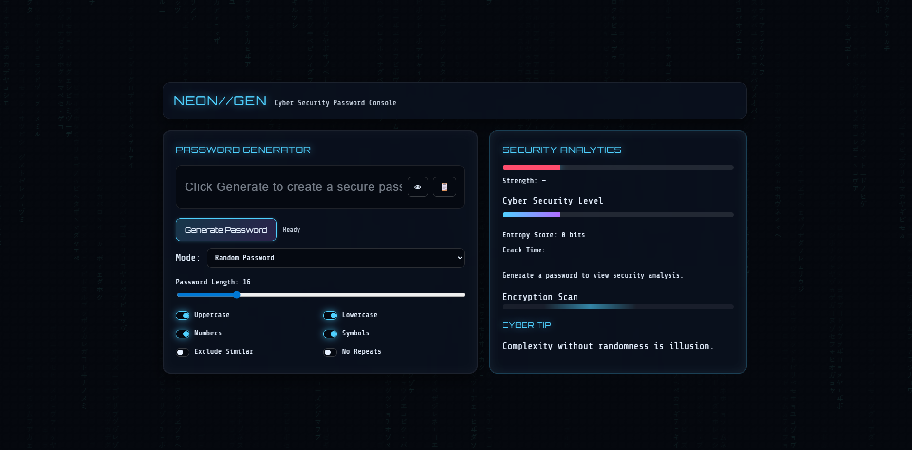

# NEON//GEN: Secure Client-Side Password Console

A zero-dependency, browser-based password generator and security analysis tool. This project explores the intersection of frontend web development and core cybersecurity concepts, demonstrating how to build secure, client-side applications with complex state management and custom UI/UX.


## 📸 Interface Preview



## 🚀 Live Demo & Repository
* **Live App:** [View NEON//GEN Live](https://ishitaverma497.github.io/password-generator/)
* **Repository:** [View Source Code](https://github.com/Ishitaverma497/password-generator/)

## 🛡️ Security Architecture

* **Zero-Trust Execution:** All generation and analysis logic runs entirely client-side. No data is ever transmitted, ensuring zero risk of interception or server-side logging.
* **Cryptographic Entropy Analysis:** Moves beyond simple regex string validation. The application calculates actual bits of entropy (`E = L × log2(R)`) based on the selected character pool size and password length to determine true cryptographic strength.
* **Brute-Force Estimation:** Translates raw entropy scores into human-readable crack time estimates, assuming a baseline processing power of 1 billion guesses per second.
* **Algorithmic Exclusions:** Implements custom filtering logic to prevent vulnerabilities like character repetition and easily confused characters (e.g., `O`, `0`, `l`, `1`).

## 💻 Frontend Engineering

* **Vanilla Architecture:** Built without React, Vue, or external CSS frameworks to demonstrate a strong foundational grasp of the core web triad (HTML, CSS, JS).
* **Modular JavaScript:** Logic is separated into distinct functions handling generation algorithms, validation rules, math operations, and DOM updates, ensuring clean, maintainable code.
* **Advanced CSS Styling:** * Utilizes native CSS variables for centralized theming and maintainability.
  * Implements responsive CSS Grid and Flexbox layouts.
  * Features complex visual techniques including glassmorphism (`backdrop-filter`) and custom CSS keyframe animations.
* **Canvas API Integration:** The background features a lightweight, performant digital rain effect rendered directly to an HTML5 `<canvas>` using `requestAnimationFrame` for optimal browser performance.

## 📂 Local Installation

No build step required. 

1. Clone the repository:
   ```bash
   git clone [https://github.com/Ishitaverma497/password-generator.git](https://github.com/Ishitaverma497/password-generator.git)
